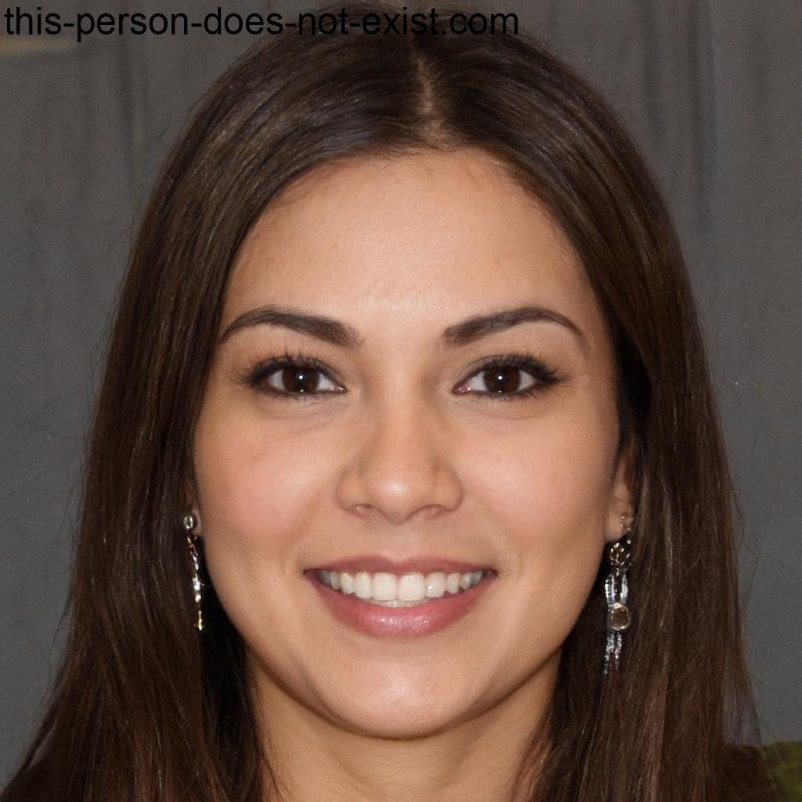

# Personas
## Introdução 
As personas são usuários fictícios os quais foram concebidas visando auxiliar na construção do processo de design por meio da geração de ideias baseadas nelas. As personas a seguir foram criadas com base nos dados, coletados em entrevistas e no questionário realizado, que formam o perfil do usário onde indentificamos dados como sexo, idade, experiência com a interface. As personas serão utilizadas em conjunto com os [Cenários](analise-de-requisitos/cenarios.md) Foi acordado de se desenvolver 4 personas uma vez que, segundo Courage e Baxter, o ideal é entre 3 a 12 personas. Além de um brainstorm em grupo, foi utilizado também para ajudar na criação das personas uma inteligencia artificial para geração das fotos e alguns dados.

## Elaboração das personas

<b>Tabela 1</b> - Persona Primária Kelly Moura.

| 
Figura 1- Persona Primária Kelly Moura
<figure markdown><figcaption>Fonte: Caio Mesquita </figcaption></figure>                                 |
| -------------------------------------------------------------------------------------------------------------------------------------------------------------------------------------------------------------------------------------------------------------------------------------------------------------------------------------------------------------------------------------------------------------------- |
| *Status*: Persona Primária.                                                                                                                                                                                                                                                                                                                                                                                        |
| *Nome*: Kelly Moura                                                                                                                                                                                                                                                                                                                                                                                            |
| *Nacionalidade/Residência*: Góias/Brasília                                                                                                                                                                                                                                                                                                                                                                                               |
| *Gênero*: Feminino.                                                                                                                                                                                                                                                                                                                                                                                                |
| *Idade*: 34 anos.                                                                                                                                                                                                                                                                                                                                                                                                  |
| *Profissão*: Advogada                                                                                                                                                                                                                                                                                                                                                                                            |
| *Escolaridade*: Graduada em Direito .                                                                                                                                                                                                                                                                                                                                                                            |
| *Estado Civil*: Casada.                                                                                                                                                                                                                                                                                                                                                                                          |
| *Relacionamento*: Colabora com vários órgãos públicos e agências governamentais em diferentes projetos e processos legais que envolvem o uso do SEI!. Mantém contato frequente com servidores públicos, analistas e outros advogados.                                                                                                                                                                                                                                                    |
| *Tarefas*: Revisão de documentos e processos armazenados no SEI!, Elaboração e envio de recursos legais e petições eletrônicas, Acompanhamento de prazos e atualizações nos processos e Colaboração com servidores públicos na preparação de documentos legais.                                                                                                                                     |
| *Habilidades e Experiências*: Advogada com 5 anos de experiência com conhecimento avançado em leis, regulamentos e procedimentos legais. Habilidade em redação jurídica e pesquisa legal. Familiarizada com a utilização de sistemas eletrônicos para gerenciamento de processos legais.                                                                                                                                                                                                           |
| *Expectativa e requisitos*: deseja que o SEI! seja uma plataforma segura e eficiente para lidar com os processos legais. Suas expectativas incluem:Acesso rápido a documentos e informações relevantes, Capacidade de colaborar com servidores públicos de forma eficaz, Notificações de prazos e atualizações automáticas, Recursos de pesquisa avançados para encontrar informações específicas rapidamente e Suporte técnico dedicado para questões legais e técnicas.                                                                                                                                                                                                                                                                                                   |

Fonte: Caio Mesquita

<b>Tabela 2</b> - Persona Secundária Rafael Pessoa.

| 
Figura 2- Persona Secundária Rafael Pessoa
<figure markdown><figcaption>Fonte: Caio Mesquita </figcaption></figure>                                 |
| -------------------------------------------------------------------------------------------------------------------------------------------------------------------------------------------------------------------------------------------------------------------------------------------------------------------------------------------------------------------------------------------------------------------- |
| *Status*: Persona Secundária.                                                                                                                                                                                                                                                                                                                                                                                        |
| *Nome*: Rafael Pessoa                                                                                                                                                                                                                                                                                                                                                                                            |
| *Nacionalidade/Residência*: Brasília/Brasília                                                                                                                                                                                                                                                                                                                                                                                               |
| *Gênero*: Masculino.                                                                                                                                                                                                                                                                                                                                                                                                |
| *Idade*: 21 anos.                                                                                                                                                                                                                                                                                                                                                                                                  |
| *Profissão*: Estágiario.                                                                                                                                                                                                                                                                                                                                                                                            |
| *Escolaridade*: Graduação em Direito em andamento.                                                                                                                                                                                                                                                                                                                                                                            |
| *Estado Civil*: Solteiro.                                                                                                                                                                                                                                                                                                                                                                                          |
| *Relacionamento*: Trabalha diretamente com o chefe de departamento, que é um analista sênior do SEI! e auxilia na organização e arquivamento de documentos.                                                                                                                                                                                                                                                    |
| *Tarefas*: Digitalização e arquivamento de documentos, auxílio na criação de processos no SEI!, treinamento básico para outros membros da equipe.                                                                                                                                    |
| *Habilidades e Experiências*: Possui conhecimento básico em informática, mas é novo na área e está aprendendo sobre a plataforma. Sua experiência anterior inclui apenas o uso de aplicativos de produtividade.                                                                                                                                                                                                                                                        |
| *Expectativa e Requisitos*: João precisa de um sistema SEI! fácil de aprender, com instruções claras e suporte para treinamento. Ele espera que o sistema seja intuitivo e tenha uma interface amigável para que possa desempenhar suas tarefas com eficiência.                                                              
|

Fonte: Caio Mesquita

<b>Tabela 3</b> - Persona Primária CLaudia Duarte.

| 
Figura 1- Persona Primária Claudia Duarte
<figure markdown><figcaption>Fonte: Caio Mesquita </figcaption></figure>                                 |
| -------------------------------------------------------------------------------------------------------------------------------------------------------------------------------------------------------------------------------------------------------------------------------------------------------------------------------------------------------------------------------------------------------------------- |
| *Status*: Persona Primária.                                                                                                                                                                                                                                                                                                                                                                                        |
| *Nome*: Claudia Duarte                                                                                                                                                                                                                                                                                                                                                                                           |
| *Nacionalidade/Residência*: Brasília/Brasília                                                                                                                                                                                                                                                                                                                                                                                               |
| *Gênero*: Feminino.                                                                                                                                                                                                                                                                                                                                                                                                |
| *Idade*: 34 anos.                                                                                                                                                                                                                                                                                                                                                                                                  |
| *Profissão*: Analista de Processos na agência governamental                                                                                                                                                                                                                                                                                                                                                                            |
| *Escolaridade*: Graduada em Gestão Pública.                                                                                                                                                                                                                                                                                                                                                                        |
| *Estado Civil*: Casada.                                                                                                                                                                                                                                                                                                                                                                                          |
| *Relacionamento*: Trabalha em equipe com outros analistas de processos e mantém contato com o departamento de TI para solucionar problemas técnicos.                                                                                                                                                                                                                                                    |
| *Tarefas*:  Elaboração, revisão e aprovação de processos no SEI!, gerenciamento de fluxos de trabalho, treinamento de colegas menos experientes.                                                                                                                                    |
| *Habilidades e Experiências*: Possui conhecimento avançado em informática e é uma usuária experiente do SEI!. Tem experiência em gerenciamento de processos governamentais.                                                                                                                                                                                                                                                           |
| *Expectativas e Requisitos*: deseja que o SEI! seja uma ferramenta eficiente para gerenciar processos, com recursos avançados de colaboração e automação de fluxos de trabalho. Ela espera que a interface seja personalizável para facilitar seu trabalho e gostaria de suporte técnico ágil para solucionar problemas.                                                                                                                                                                                                                                                                                      |
Fonte: Caio Mesquita

<b>Tabela 4</b> - Persona Primária Thiago Fonseca.

| 
Figura 4- Persona Primária Thiago Fonsceca
<figure markdown><figcaption>Fonte: Caio Mesquita </figcaption></figure>                                 |
| -------------------------------------------------------------------------------------------------------------------------------------------------------------------------------------------------------------------------------------------------------------------------------------------------------------------------------------------------------------------------------------------------------------------- |
| *Status*: Persona Primária.                                                                                                                                                                                                                                                                                                                                                                                        |
| *Nome*: Thiago Fonseca                                                                                                                                                                                                                                                                                                                                                                                           |
| *Nacionalidade/Residência*: Minas Gerais/Brasília                                                                                                                                                                                                                                                                                                                                                                                               |
| *Gênero*: Masculino                                                                                                                                                                                                                                                                                                                                                                                             |
| *Idade*: 48 anos.                                                                                                                                                                                                                                                                                                                                                                                                  |
| *Profissão*: Gerente de Departamento em uma agência governamental                                                                                                                                                                                                                                                                                                                                                                                           |
| *Escolaridade*: Graduado em Admnistração.                                                                                                                                                                                                                                                                                                                                                                            |
| *Estado Civil*: Casado.                                                                                                                                                                                                                                                                                                                                                                                          |
| *Relacionamento*: Trabalha em colaboração com todos os níveis de funcionários, incluindo Claudia e Rafael, e interage com outros departamentos.                                                                                                                                                                                                                                                    |
| *Tarefas*:  Supervisão de processos, aprovação de processos críticos, tomada de decisões estratégicas, implementação de políticas e treinamento de pessoal.                                                                                                                                     |
| *Habilidades e Experiências*: tem ampla experiência em administração pública e é um usuário experiente do SEI!. Possui habilidades de liderança e gestão.                                                                                                                                                                                                                                                            |
|*Expectativa e Requisitos*: precisa que o SEI! seja uma ferramenta confiável para tomada de decisões estratégicas. Ele espera que a plataforma ofereça relatórios detalhados, segurança robusta e suporte técnico rápido. A interface deve ser eficiente e permitir personalização para atender às necessidades de gerenciamento de sua equipe.|

Fonte: Caio Mesquita

## Bibliografia
> BARBOSA, Simone; SILVA, Bruno. Interação Humano-Computador, Capítulo 5. Edição de 2010, São Paulo. Editora: Elsevier Editora Ltda. 
> Chat GPT. Acesso em: 17/10/2023. Disponível em: <https://chat.openai.com>
> This Person Doest Not Exist. Acesso em: 17/10/2023. Disponível em: <https://this-person-does-not-exist.com/en>

| Versão | Data       | Descrição                                       | Autor(es)                                                                                     | Revisor(es)                                      |
| ------ | ---------- | ----------------------------------------------- | ------------------------------------------------| ------------------------------------------------ |
| `1.0`  | 17/10/2023 | Criação da página de personas. | [Caio Mesquita](https://github.com/Caiomesvie)  | [Lucas Caldas](https://github.com/lucascaldasb)
