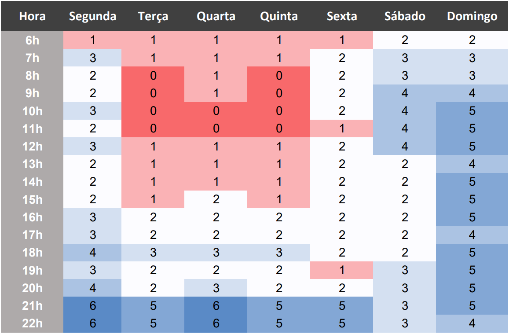

# Heatmap

## Sobre o heatmap
Um heatmap é uma representação visual de dados que usa cores para indicar a intensidade ou a frequência de um fenômeno. Por exemplo, um heatmap pode mostrar as áreas mais visitadas de um site, as regiões mais afetadas por uma doença ou as temperaturas médias de um país. Um heatmap pode ajudar a identificar padrões, tendências ou anomalias nos dados, facilitando a análise e a tomada de decisões.
Utilizamos o heatmap como uma ferramenta que nos permite visualizar a disponibilidade horária de cada membro da equipe, baseada em seus compromissos pessoais, profissionais e acadêmicos. Com essa informação, podemos agendar as reuniões de forma mais eficiente e respeitosa, evitando conflitos de agenda e sobrecarga de trabalho. Assim, garantimos que todos os integrantes da equipe possam participar ativamente do projeto e contribuir com suas ideias e habilidades.

## Resultados

Para saber a disponibilidade de cada um o mais rápido possível, fizemos um formulário online, no qual cada integrante assinalava em uma tabela um checkbox com os dias da semana e os horários em que estaria disponível. Assim mesmo com esse heatmap inacabado conseguimos defir os melhores dias paras as reuniões. E com os dados obtidos produzimos a seguinte tabela de heatmap.

Tabela 1: Heatmap.

Fonte: [Pablo S. Costa](https://github.com/pabloheika).

A partir dos dados da tabela acima, podemos estabelecer nossos encontros principalmente nas segundas e quartas às 21 horas. Esses horários são os mais convenientes para a maioria dos membros do grupo, considerando as suas disponibilidades e compromissos. Além disso, esses horários permitem que tenhamos tempo suficiente para discutir os assuntos relevantes para o nosso projeto.

## Bibliografia

> - All About Heatmaps. Disponível em: [https://towardsdatascience.com/all-about-heatmaps-bb7d97f099d7](https://towardsdatascience.com/all-about-heatmaps-bb7d97f099d7). Acesso em: 30 de set. de 2023.
>

## Histórico de Versões

| Versão | Data | Descrição | Autor(es) | Revisor(es) |
| :----: | :--: | --------- | ----------- | ------ |
| `1.0`  | 30/09/2023 | Criação do documento | [Pablo S. Costa](https://github.com/pabloheika)  |  |
